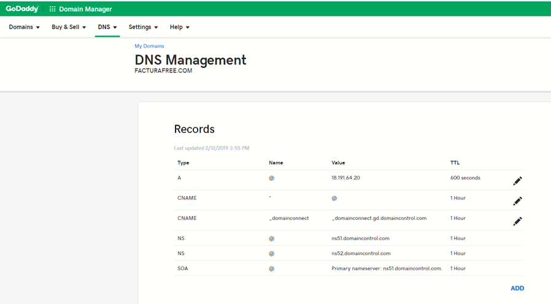

# Tutorial para Script de Instalación


## Manual para Script de Instalación
Docker | GitLab | Opción SSL | Opción SSH

**Descripción**

Hemos elaborado un script para uso en instancias Linux con Ubuntu 18 o superior. Este es un archivo que actualiza el sistema, instala las herramientas, sus dependencias y realiza todas las configuraciones previas, dejando el aplicativo listo para probar en menos de 20 minutos (siempre y cuando el dominio ya esté configurado hacia la instancia). Su ejecución es muy sencilla.

**Requisitos previos**

# Requisitos Previos

- Tener acceso a su servidor, vps, máquina virtual o local via SSH, en las instalaciones que realizamos para AWS o Google Cloud, hacemos entrega del usuario, la IP del servidor y la clave ssh que puede ser un archivo .ppk o .pem, recuerde almacenarlas en su equipo local.

- Tener instalada una versión de SSH en su máquina para conectarse de manera remota. Puede utilizar herramientas como Putty, FileZilla o una consola terminal. Para obtener más información sobre el acceso SSH, consulte los siguientes manuales:
  - [Guía para acceder con Putty (gestión de servidor)](enlace_putty)
  - [Guía para acceder con Winscp (gestión de archivos con aplicación de escritorio)](enlace_winscp)

- Si es posible configurar su dominio apuntando a su instancia para que al finalizar la instalación se encuentre disponible el aplicativo. Edite los récords A y CNAME donde A debe contener su IP y CNAME el valor * (asterisco) para que se tomen los subdominios registrados por la herramienta.



- En caso de contar con servicios instalados en su instancia como mysql, apache o nginx, debe detenerlos, ya que estos ocupan los puertos que pasarán a usar el aplicativo con los contenedores de Docker.


## **Pasos**

1. Acceder a su instancia vía SSH.
2. Loguearse como super usuario ejecutando `sudo su`.
3. Clonar el snippet de GitLab que contiene el script:
   ```bash
   git clone https://gitlab.com/snippets/2079063.git script
4. Ingrese a la carpeta clonada:
   ```bash
   cd script
5. Dar permisos de ejecución al script:
   ```bash
   chmod +x install sh
6. El comando a utilizar para iniciar el despliegue requiere de un parámetroprincipalmente:
   ```bash
   ./install.sh[dominio]

- por ejemplo:
   ```bash
   ./install.sh facturador.pro

7. Una vez ejecutado el comando, iniciará el proceso de actualización del sistema, en el cual se le solicitará:

   **A.Usuario y Contraseña de GitLab:**
    - Para que se pueda descargar el proyecto en su instancia.

   **B.Instalación de SSL Gratuito:**
    - Si desea instalar SSL gratuito, tenga en cuenta que este debe ser actualizado cada 90 días. El mensaje será el siguiente:
      ```bash
      ¿Instalar con SSL? (debe tener acceso al panel de su dominio para editar/agregar records TXT). si[s] no[n]
      ```
      Deberá contestar con "s" o "n" para continuar.

    - Si selecciona SÍ, deberá contestar las siguientes preguntas con "y", son 2 en total. Seguidamente se le ofrecerá un código que debe añadir en un récord tipo TXT en su dominio quedando como `_acme-challenge.example.com` o simplemente `_acme-challenge` dependiendo de su proveedor.

    - Para continuar, presione Enter. Luego deberá repetir las acciones para añadir un segundo código y habrá finalizado la configuración. Si el proceso es exitoso, la ejecución del script continuará.

   **C.Configuración de Clave SSH para Actualización Automática:**
   - Si desea obtener y gestionar actualizaciones automáticas, deberá disponer de su sesión de GitLab al momento:
     ```bash
     ¿Configurar clave SSH para actualización automática? (requiere acceso a https://gitlab.com/profile/keys). si[s] no[n]
     ```
     Deberá contestar con "s" o "n" para continuar.

   - De seleccionar SÍ, al final del despliegue se le dará un extracto de texto que debe añadir a su configuración de GitLab.

    

8. **Finalización del Script:**
   Dependiendo de sus selecciones anteriores, se le entregará varios datos que debe guardar, como:
   - Usuario administrador.
   - Contraseña para usuario administrador.
   - URL del proyecto.
   - Ubicación del proyecto dentro del servidor.
   - Clave SSH para añadir a GitLab (obligatorio para quienes seleccionan la instalación de SSH).

## Enlaces de Interés

- [Actualización de SSL](https://gitlab.com/b.mendoza/facturadorpro3/snippets/1955372)
- [Actualización mediante ejecución de script para instalaciones Docker](https://gitlab.com/b.mendoza/facturadorpro3/-/wikis/Script-Update-Docker)
- [Gestión de SSL independiente, no el que incorpora el script](http://localhost:3000/docs/intro4)
- [Guía GitLab para la instalación](https://gitlab.com/b.mendoza/facturadorpro3/snippets/1971490), contiene el script usado en el presente manual, además posee los parámetros extras que pueden usarse en la ejecución del paso 6.