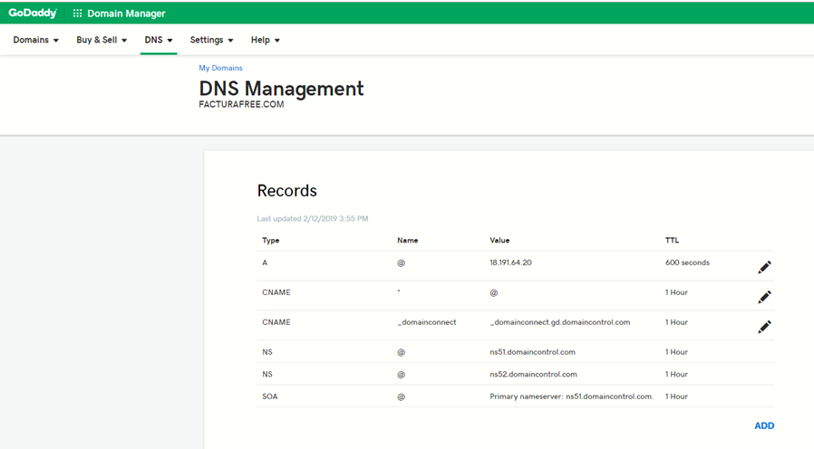
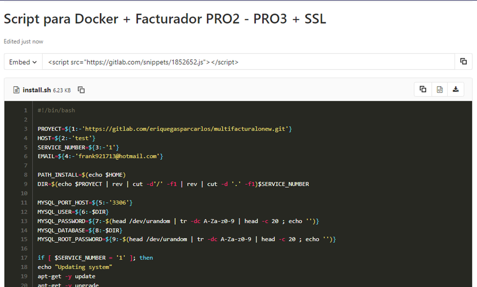
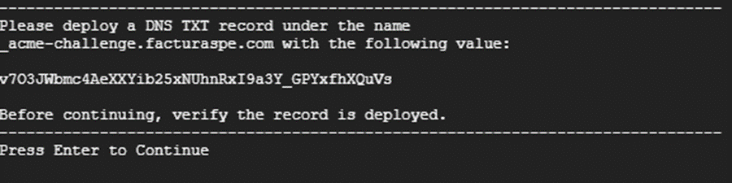
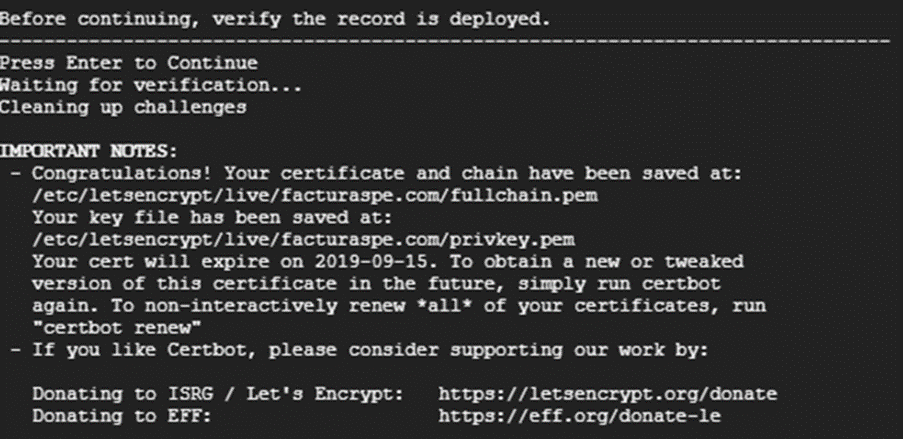

# Tutorial de Instalación Docker + GitLab + SSL 

## Manual de Instalación Docker + GitLab + SSL

*PRO 1 | PRO 2*

**Descripción**

Hemos elaborado un script para uso en instancias Linux, este es un archivo .sh que actualiza el sistema, instala las herramientas, sus dependencias, configura un certificado SSL renovable cada 90 días que debe ser confirmado en el proceso con su dominio y realiza todas las configuraciones previas, dejando el aplicativo listo para probar en menos de 20 minutos, su ejecución es muy sencilla.

**Requisitos previos**

- Tener acceso a su servidor, VPS, máquina virtual o local vía SSH. En las instalaciones que realizamos para AWS o Google Cloud, hacemos entrega del usuario, la IP del servidor y la clave SSH que puede ser un archivo .ppk o .pem.
- Tener instalada una versión de SSH en su máquina para conectarse de manera remota, puede utilizar Putty, FileZilla o una consola terminal.
- Es importante configurar su dominio apuntando a la IP de su instancia para que durante la ejecución del script se valide el certificado SSL y al finalizar la ejecución no tenga errores y todo esté listo para realizar pruebas. Edite los registros A y CNAME donde A debe contener su IP y CNAME el valor * (asterisco) para que se tomen los subdominios registrados por la herramienta.



- Durante la ejecución del script deberá almacenar en su dominio dos registros TXT con unos valores que se mostrarán en pantalla, estos registros son validados en directo y no pueden tardar más de 2 minutos en validarse en su dominio.

- En caso de contar con servicios instalados en su instancia como MySQL, Apache o Nginx, debe detenerlos, ya que ocupan los puertos que pasarán a usarse con el aplicativo y los contenedores de Docker.

## Pasos de Instalación

1. Acceder a su instancia vía SSH.
   
2. Loguearse como super usuario:
   ```bash
   sudo su
3. Ubicarse en la carpeta del usuario, por ejemplo:
   ```bash
   cd /home/ubuntu/
4. Crear el archivo install ejecute:
   ```bash
   touch install.sh
5. Editar el archivo con su editor preferido ejecute:
   ```bash
   nano install.sh
6. En el archivo, debe agregar el contenido del siguiente enlace: [https://gitlab.com/snippets/1852652](https://gitlab.com/snippets/1852652).
Observará una página como la siguiente, donde debe copiar el contenido del script y pegarlo en su archivo `install.sh`. Es importante que mantenga la estructura del mismo.



7. Para salir del editor y guardar, puede presionar "Ctrl + X". Seguidamente, se le consultará si desea guardar los cambios; confirme con "Y" y luego "enter".
8. Debe darle permisos de ejecución al archivo ejecute:
   ```bash
   chmod +x install.sh
9. El comando a utilizar requiere de dos parámetros principalmente:
   ```bash
   ./install.sh [repositorio] [dominio]
- por ejemplo:
      ```bash
      ./install.sh https://gitlab.com/rash07/facturadorpro2 elfacturador.com
10. Una vez ejecutado el comando, se iniciará un proceso en el que deberá responder preguntas. Este proceso le mostrará en pantalla los valores que debe añadir en los 2 registros tipo TXT de su dominio con los siguientes nombres:

- `_acme-challenge.example.com`
- `_acme-challenge` (en casos como godday y puntope)

En la siguiente imagen se muestra el valor como **v703JW**.... Deberá copiarlo y añadirlo al primer registro TXT. Luego, pulse "Enter", y se le mostrará en pantalla un segundo valor para el segundo TXT.



11. Una vez editados los registros en su dominio, deberá aceptar para continuar y permitir que el proceso verifique si ha sido exitoso. En caso de éxito, obtendrá una pantalla similar a la siguiente:



12. El proceso de actualización del sistema continuará, solicitándole el usuario y contraseña de GitLab para clonar/descargar el proyecto en su instancia. Una vez culminado, tendrá acceso a través de su dominio con las siguientes credenciales:

- Correo: admin@gmail.com
- Contraseña: 123456

Una vez finalizado, puede proseguir con el manual de pruebas u otra documentación relevante para cada proyecto. Las URL respectivas son:

**PRO1:**
[https://gitlab.com/rash07/facturadorpro1](https://gitlab.com/rash07/facturadorpro1)

**PRO2:**
[https://gitlab.com/rash07/facturadorpro2](https://gitlab.com/rash07/facturadorpro2)

## Recomendaciones Post-Instalación

- Luego de instalar el facturador puede cambiar algunos parámetros en el archivo .env como:

   - La dirección de envío de correos que utiliza el facturador para enviar los archivos pdf, xml y cdr a sus clientes

   - Cambiar algunas configuraciones de plantillas de los pdf 

- Recuerde que siempre que se edita el archivo .env debe utilizar el comando “php artisan config:cache” dentro del contenedor de fpm1, para más detalles puede observar el manual de actualización [Aquí](https://docs.google.com/document/d/11PI1a9yjCPfH9CCuWmJSrdj1V8IEUffqurqvdkw29co/edit?usp=sharing)
- La ruta donde ejecute el script será donde se clone el repositorio, debe verificar que los usuarios del servidor tengan permisos a dicha ruta si desea acceder desde ftp o scp.
